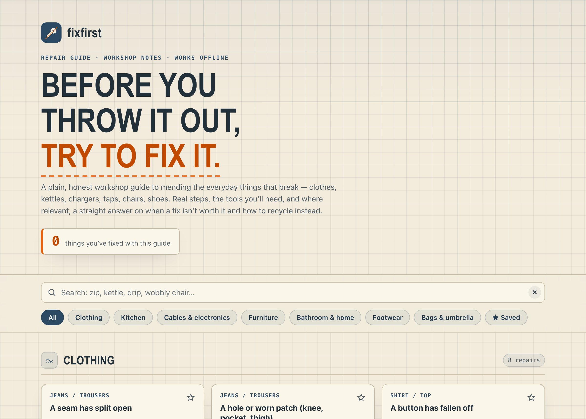

# fixfirst

**Repair it before you replace it.** A plain, honest workshop guide to fixing the everyday household things that break — jeans, kettles, chargers, taps, chairs, shoes, umbrellas — with real step-by-step instructions, the tools and materials you'll need, safety notes where they matter, and a straight answer on when a fix genuinely isn't worth it and how to recycle instead. 100% client-side, zero dependencies, works fully offline.

## Why

The instinct when something breaks is to bin it and buy another. But a huge share of "broken" household things — a zip that splits, a kettle that won't heat, a wobbly chair, a dripping tap — are a five-to-thirty-minute fix once you know the actual cause. Most online guides bury that behind ads, videos, and filler, or push you straight to buying a new one.

fixfirst is the opposite: pick the thing and the problem, and you get a single clear repair card. Concrete numbered steps, the exact tools and materials, a difficulty and time estimate, a safety note where it's warranted, and — crucially — an honest note on the point where fixing stops making sense, plus how to recycle the item responsibly. No selling, no filler.

## What's inside

- **A curated corpus of common repairs** across seven categories: Clothing, Kitchen, Cables & electronics, Furniture, Bathroom & home, Footwear, and Bags & umbrella.
- **A proper repair card for each** — difficulty (Easy / Moderate / Involved), rough time, tools, materials, numbered steps, an optional safety note, and an "if this doesn't work" block covering when to replace and how to recycle.
- **Safety-first on anything risky** — for electrical, gas, or pressurised items it gives only the safe user-serviceable checks and then tells you to call a qualified professional. It never tells you to open a mains appliance.
- **Search and browse** — filter by category or search by keyword ("zip", "drip", "wobbly chair").
- **Mark what you've fixed** and star favourites — a small running tally of things you've repaired, saved on your device.

## Quickstart

Just open `index.html` in any modern browser — no build step, no server, no install.

- **Local:** double-click `index.html`, or run any static file server in the folder.
- **Hosted:** **[Open fixfirst live](https://sreenivas-sadhu-prabhakara.github.io/fixfirst/)**

Your "fixed" tally and favourites are saved in your browser's local storage, so they persist between visits on that device.

## Privacy

fixfirst is built to be self-contained and trustworthy.

- A strict Content-Security-Policy sets `connect-src 'none'`: the app **cannot** make any network request, even if it tried.
- No external fonts, scripts, images, analytics, or tracking. Everything is in the files you can see.
- All logic runs in your browser. Your tally and favourites live only in this browser's local storage and are never transmitted anywhere.
- Because there are no network dependencies, it works fully **offline** — download it once and keep it.

## Disclaimer

fixfirst provides general repair guidance for educational purposes only. It is **not** professional repair, electrical, plumbing, gas, engineering, or safety advice. Know your limits: never open mains appliances beyond safe, clearly user-serviceable steps, and for anything electrical, gas, or pressurised, call a qualified professional if the safe first checks don't resolve it. Steps are general and may not fit your specific item or situation. This software is provided under the MIT License, "as is", without warranty of any kind; the author accepts no liability for any loss, injury, or damage arising from its use. **You use these guides entirely at your own risk.**

## License

[MIT](./LICENSE) © 2026 Sreenivas Sadhu Prabhakara
